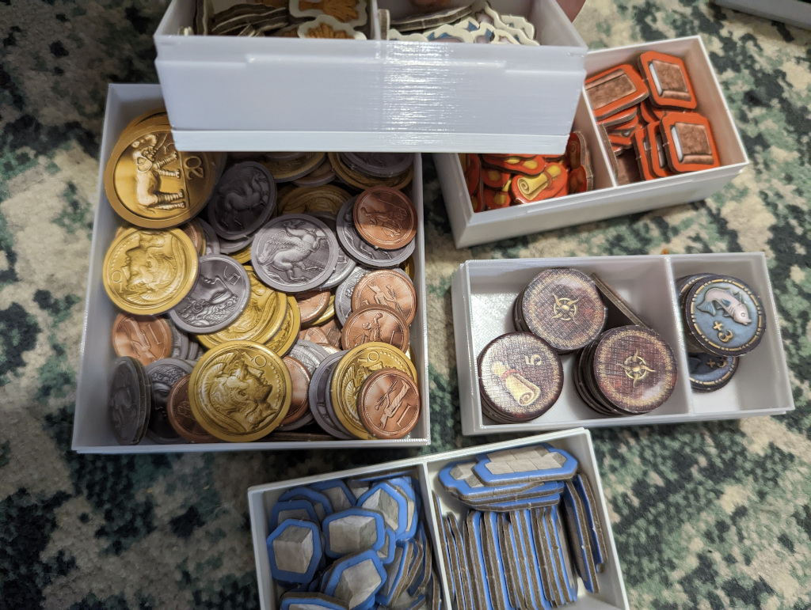

# Mosaic Retail Edition Insert

This is an insert for the retail edition, **not** the colossus edition!
There are 3 lid for anything with the lid, you can choose the solid version, the hex version, and the hex with the text. You don't need all. 

- **player_bottom_x3**: 3 of this, no lid. 
- **player_top_x3**: 3 of this, with 3 lids. 
- **resources_x3**: 3 of this, with 3 lids
- **cache_and_fish_x1**: one of this, with a lid
- **money_with_compartment_x1** **OR** **money_no_compartment_x1**: the lid for both are the same, but you need one of this. the compartment version has 4 compartments, to separate the coins by value, **BUT** the space is not enough and you can not fit all coins with value 10, the other one has no compartments, but can hold all coins
- **cards_tech_x1**: One with the lid
- **other_cards_top_x1**: One with the lid 
- **other_cards_bottom_x2**: Two, no lid
- **leader_cards_first_player_x1**: one with lid
- **good_tiles_x1**: One, no lid
- **card_tiles_x1**: One, with lid

## Caveats
The box is barely fit all the components in the first place, and my goal was to create a player piece that helps during the play. 

The cards holder is too tight, and sleeved cards never fit there. 
The coin box with compartments, can not hold all the coin, but the other alternate version without compartment, fits all the coin. You need one of those, and the lid for both is the same. There are boxes that can hold the extra coins Wonder hex tiles could go with wonder tiles or the starting tile in **leader_cards_first_player_x1** box.

Also the resource boxes (**resources_x3**) and the coin box (**money_with_compartment_x1** **OR** **money_no_compartment_x1**) and the cache and fish box (**cache_and_fish_x1**) need to be stored vertically, in the space next to the board.

## Images

    
My print result

    
    
    
    
    
    
    
    
    
    
    
    

- My copy misses a punch board, asked the Forbidden games, no answer yet, so the box with the tiles is half empty. it should be full, I tested the size using the tiles that I have
- I used two different printer to print theses, mine was broken at the time, and the second half is printed using mine (the "stronger" white boxes) so the quality is not the same in these pictures. 
## Links

Created using [The Boardgame Insert Toolkit](https://github.com/dppdppd/The-Boardgame-Insert-Toolkit) 

Tested with [The Mosaic English Edition](https://boardgamegeek.com/boardgameversion/548112/english-edition)